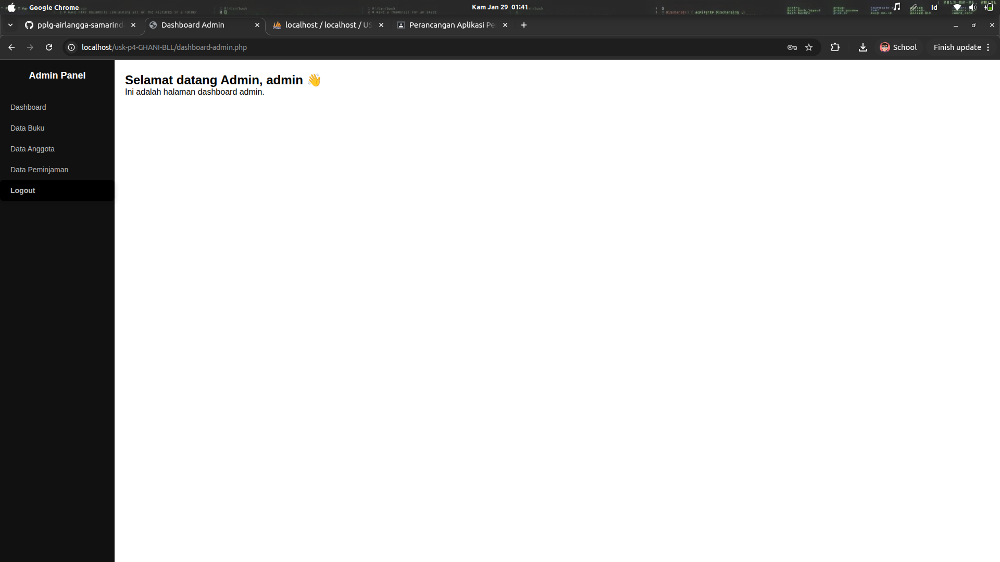
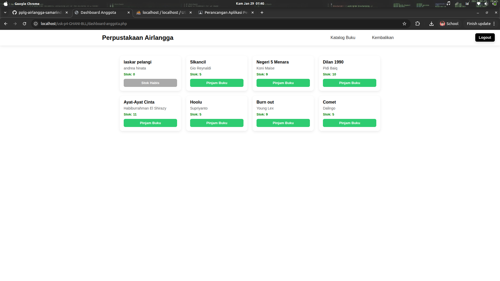

## Preview USK

Sistem Manajemen Perpustakaan berbasis web untuk mengelola peminjaman dan pengembalian buku.

<p align="center">
  
  
</p>

## ୧⍤⃝Identitas

- Nama : Ghani
- Sekolah : SMK TI Airlangga
- Jurusan : PPLG

```bash
USK-P4-GHANIBLL/
├── anggota/              # Modul untuk anggota perpustakaan
│   ├── create.php
│   ├── delete.php
│   ├── edit.php
│   └── index.php
├── buku/                 # Modul untuk manajemen buku
│   ├── create.php
│   ├── delete.php
│   ├── edit.php
│   └── index.php
├── database/             # Database dan konfigurasi
│   ├── USK_GHANIBLL (1).sql
│   └── USK_GHANIBLL.sql
├── foto/                 # Folder penyimpanan gambar
│   ├── admin/
│   └── siswa/
├── peminjaman/           # Modul peminjaman buku
│   ├── create.php
│   ├── delete.php
│   ├── edit.php
│   ├── index.php
│   ├── dashboard-admin.php
│   ├── dashboard-anggota.php
│   ├── form-pengembalian.php
│   ├── form-pinjam.php
│   ├── koneksi.php
│   └── login_proses.php
├── login.css             # Styling untuk halaman login
├── login.php             # Halaman login
├── logout.php            # Proses logout
├── readme.md             # Dokumentasi proyek
├── register.php          # Halaman registrasi
├── register_proses.php   # Proses registrasi
└── styles.css            # Styling global
```
